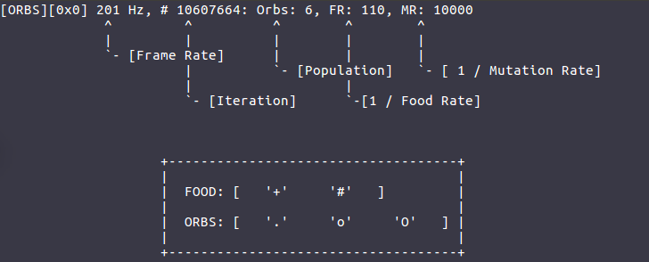
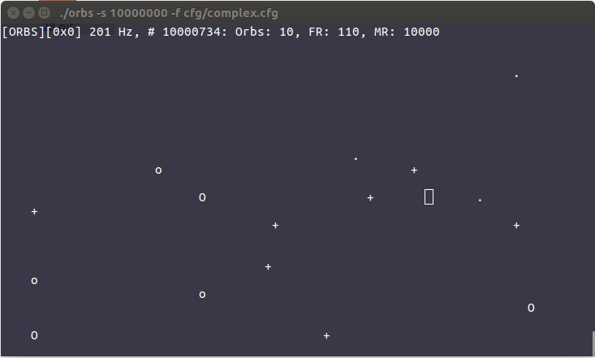
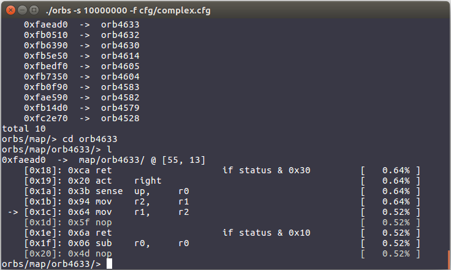

# ORBS

*ORBS* is a console based life simulator of *orb* entities written in C. It combines a simple 8-bit instruction set and respective simulator with a genetic algorithm.

## The simulation
Each *orb* ('.', 'o', 'O') is essentially a little micro-processor with registers and status flags.
The genome of the *orb* is it's instruction memory ("Havard architecture").
The world it is living in consists of other *orbs* and food ('+', '#').



If an *orb* hits food it eats the food automatically, which increases its *score*.
Every, by the *orb*, executed instruction reduces it's *score* by a given amount. The *score* of an *orb* reaches 0 it dies.
The *score* of an *orb* also determines whether it is able to reproduce itself or not.
When two *orbs* meet, they reproduce if they are able to. Reproduction is performed by the genetic algorithm, creating two new *orbs*.



## The simulator
The simulator is console based and offers different levels of interaction.
The simulation can be paused by pressing the `p` key.
This opens a shell allowing a more detailed analyses like the disassembly of the genome of an *orb*.



With `w` and `s` the simulation speed can be changed.
The different parameters of the simulation like the mutation rate, can be configured via the command line or by providing a configuration file.
For a documentation of the configurable parameters run:
```
./orbs --config-info
```

# Build

In order to build `orbs` you need `cmake (version >= 3.5)`, the GNU C libraries
readline, argp (Mac OS) and optionally if you want to build the unit-tests
`google-test (version >= 1.8)`.

1. Install `cmake`:
    ```
    sudo apt install cmake # Ubuntu
    brew install cmake # Mac OS (brew)
    ```
2. Install readline and argp
    ```
    sudo apt install libreadline6-dev # Ubuntu
    brew install readline # Mac OS (brew)
    brew install argp-standalone # Mac OS (brew)
    ```
3. (Optional) Install `google-test`:
    ```
    wget https://github.com/google/googletest/archive/release-1.8.0.tar.gz
    tar -xzf release-1.8.0.tar.gz && cd googletest-release-1.8.0
    mkdir build && cd build
    cmake .. -DCMAKE_INSTALL_PREFIX=install -DCMAKE_CXX_STANDARD=11
    make && make install
    export GTEST_ROOT=`pwd`/install
    export GMOCK_ROOT=$GTEST_ROOT
    ```

4. Configure and build `orbs`, default `BUILD_TESTS=OFF`:
    ```
    cd orbs;
    mkdir build && cd build;
    cmake ../ -DBUILD_TESTS=[ON/OFF]
    make
    ```

# TODO
- [ ] Generate statistics/plots, e.g. avg. instruction usage over time
- [ ] Coloring for map, orbs, etc.
- [X] Unit test for `list`
- [X] Unit test for `mm`
- [ ] Unit test for `stats`
- [ ] Unit test for `config`
- [ ] Unit test for `shell`
- [ ] Unit test for `map`
